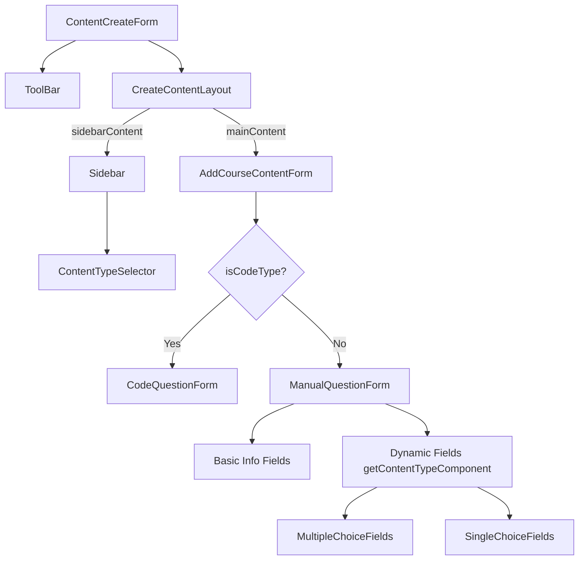

# Deep React Feature Documentation: Question Management

## 1. Feature Overview

**Feature Name:** Question Management (formerly Content Management)
**Purpose:** Allows instructors and course creators to manage, create, and organize various types of questions (Multiple Choice, Single Choice, Fill in the Blanks, Subjective, Blog, Video, Code) within a specific lesson or unit of a course.
**Business/User Problem:** Provides a unified interface to add interactive content/questions to courses, complete with validation, scoring, and type-specific configurations.
**Main Functionality:**
- View existing questions in a sidebar for a specific unit.
- Delete existing questions.
- Select a content type to add a new question.
- Fill out dynamic forms based on the question type selected.
- Save questions to the backend.
**Entry Point:** `src/features/question-management/pages/index.tsx` (Component: `ContentCreateForm`)
**Important Files and Folders:**
- `pages/index.tsx`: Main page layout and question list.
- `pages/AddContent.tsx`: Form wrapper for creating questions.
- `components/ManualQuestionForm.tsx`: Reusable form component for non-code questions.
- `components/question-templates/`: Directory containing dynamic fields for each question type.
- `api/contentApi.ts`: Redux RTK Query mutations for creating questions.
- `api/courseProgressApi.ts`: Redux RTK Query for fetching questions.
**External Dependencies:** `@mui/material`, `react-hook-form`, `react-router-dom`
**APIs Used:** RTK Query (from `contentApi.ts`, `courseProgressApi.ts`, and `courseApi.ts`)
**State Management:** Local State (`useState`), Form State (`react-hook-form`), Global API State (`RTK Query`)

---

## 2. Feature Architecture

The feature follows a container-presenter pattern with dynamic form rendering based on the selected question type. It relies heavily on RTK Query for data fetching and mutations, and `react-hook-form` for complex form state management.

```text
ContentCreateForm (Container / Page)
│
├── ToolBar (External)
│   └── CourseInfoHeader (Presentational)
│
└── CreateContentLayout (Layout)
    │
    ├── Sidebar (List & Actions)
    │   ├── Add Question Button
    │   ├── ContentTypeSelector (Dropdown)
    │   └── Question List Items (with Delete Action)
    │
    └── Main Content (Form)
        └── AddCourseContentForm (Container / Wrapper)
            ├── CodeQuestionForm (For Code Types)
            └── ManualQuestionForm (For Standard Types)
                ├── Basic Info Fields (Title, Desc, Score)
                └── Dynamic Fields (via getContentTypeComponent)
                    ├── MultipleChoiceFields
                    ├── SingleChoiceFields
                    ├── FillUpFields
                    ├── SubjectiveFields
                    ├── BlogFields
                    └── VideoFields
```

---

## 3. Component-by-Component Documentation

### ContentCreateForm

**File:** `src/features/question-management/pages/index.tsx`

**Responsibility:** Acts as the entry point and main container for the question management feature. It fetches course data, content types, and the existing questions for the selected unit. It manages the layout, Sidebar list, and controls which form is displayed in the main content area.

**Why this component exists:** To compose the layout and connect the global API state (RTK Query) to the presentational UI elements. It holds the "selected question" and "add new question" states.

**Props:** None (Uses React Router hooks for URL params)

**Local State:**
- `addType` (string | null): The currently selected question type to add.
- `anchorEl` (HTMLElement | null): For the Add Question dropdown menu.
- `showForm` (boolean): Whether to render the form.
- `selectedId` (number | null): The ID of the currently selected question in the sidebar.
- `formKey` (number): Used to force re-mount the form when switching types.

**Hooks:**
- `useLocation()`, `useParams()`: Reads `courseId`, `lessonId`, `contentTypeId`.
- `useGetCourseByIdQuery()`: Fetches course metadata.
- `useGetContentTypeByIdQuery()`: Fetches allowed question types.
- `useGetContentByTopicIdQuery()`: Fetches existing questions for the sidebar.
- `useDeleteQuestionMutation()`: Mutation to delete a question.
- `useEffect()`: Auto-selects the first question on load, and auto-opens the form if URL params demand it.

### AddCourseContentForm

**File:** `src/features/question-management/pages/AddContent.tsx`

**Responsibility:** Wraps the actual forms (`CodeQuestionForm` or `ManualQuestionForm`) and provides them with the submit handlers connected to the appropriate RTK Query mutations.

**Why this component exists:** To separate API submission logic from the form UI. It interprets the `type` prop and routes the submission to the correct API endpoint.

**Props:**
| Prop | Type | Required | Source | Purpose |
|------|------|----------|--------|---------|
| type | string | Yes | ContentCreateForm | Determines which API to call and which form to render |
| lessonId | number | Yes | ContentCreateForm | Payload parameter for API |
| courseId | number | No | ContentCreateForm | Context |
| contentTypeId | number | No | ContentCreateForm | Payload parameter |
| onClose | function | Yes | ContentCreateForm | Triggered after successful submit |

**Local State:**
- `notification` (object): Controls the success/error Snackbar (open, message, severity).

**Hooks:**
- RTK Query Mutations: `useCreateVideoContentMutation`, `useCreateMcqContentMutation`, etc.
- `useGetCodeLanguagesQuery()`: Fetches available languages for code questions.

### ManualQuestionForm

**File:** `src/features/question-management/components/ManualQuestionForm.tsx`

**Responsibility:** Renders the form UI using `react-hook-form`. It contains static fields (Title, Description, Score) and dynamically injects specific fields based on the question type.

**Why this component exists:** To handle form validation and user input collection efficiently without re-rendering the whole page.

**Props:**
| Prop | Type | Required | Source | Purpose |
|------|------|----------|--------|---------|
| type | string | Yes | AddCourseContentForm | Used to fetch dynamic fields via `getContentTypeComponent` |
| lessonId | number | Yes | AddCourseContentForm | Context |
| onClose | function | Yes | AddCourseContentForm | Cancels the form |
| onSubmit | function | Yes | AddCourseContentForm | Submits the validated form data |
| isLoading | boolean | Yes | AddCourseContentForm | Disables buttons during API call |

**Local State / Form State:**
- Managed entirely by `react-hook-form` via `useForm<ICreateCourseContent>()`.

**Hooks:**
- `useForm()`: Initializes form state with default values.
- `useFieldArray()`: Manages dynamic lists (e.g., MCQ options).
- `useWatch()`: Watches `options` to enforce single-choice logic (radio button behavior).
- `useEffect()`: Enforces that single choice questions have exactly one correct option.

---

## 4. Complete Data Flow

**Viewing Existing Questions:**
```text
Component Mount (ContentCreateForm)
 ↓
useGetContentByTopicIdQuery (lessonId, courseId)
 ↓
RTK Query fetches from API `/practice/course/:courseId/lesson/:lessonId`
 ↓
Data returned as `questionsData`
 ↓
Mapped to `content` array
 ↓
Sidebar maps over `content` and renders items
```

**Creating a Question:**
```text
User selects Type in Sidebar
 ↓
`setAddType(type)`, `setShowForm(true)`
 ↓
Renders `AddCourseContentForm(type)`
 ↓
Renders `ManualQuestionForm(type)`
 ↓
User fills form & clicks Save
 ↓
react-hook-form validates data
 ↓
onSubmit triggered in `ManualQuestionForm`
 ↓
handleContentSubmit triggered in `AddCourseContentForm`
 ↓
Calls correct RTK Query mutation (e.g., `createMcqContent`)
 ↓
HTTP POST to `/question`
 ↓
API Returns Success
 ↓
Shows Snackbar Notification
 ↓
`onClose` triggered → Calls `refetchQuestions()` in `ContentCreateForm`
 ↓
Sidebar updates with new question
```

---

## 5. Component Interaction

**ContentCreateForm → AddCourseContentForm**
- **Trigger:** User selects a question type to add.
- **Data passed:** `type`, `lessonId`, `onClose` callback.
- **Action:** `ContentCreateForm` mounts `AddCourseContentForm`. When `onClose` is called, `ContentCreateForm` refetches the list and hides the form.

**AddCourseContentForm → ManualQuestionForm**
- **Trigger:** `AddCourseContentForm` determines it is not a "code" question.
- **Data passed:** `type`, `isLoading`, `onSubmit` callback.
- **Action:** `ManualQuestionForm` handles the UI. On submit, it calls the `onSubmit` callback with the formed `ICreateCourseContent` object.

---

## 6. Event Flow

### Deleting a Question
```text
User clicks Delete Icon in Sidebar
 ↓
onClick -> handleDeleteQuestion(id)
 ↓
window.confirm() prompt
 ↓
useDeleteQuestionMutation(id)
 ↓
API DELETE request
 ↓
Success
 ↓
refetchQuestions()
 ↓
Sidebar updates
```

### Form Validation (Single Choice)
```text
User checks a correct option in SingleChoiceFields
 ↓
useWatch detects change in `options`
 ↓
useEffect in ManualQuestionForm runs
 ↓
Finds the checked index, unchecks all other options
 ↓
Updates form state via react-hook-form
 ↓
UI reflects single radio button selection
```

---

## 7. API / Backend Interaction

| API | Method | Called From | Trigger | Payload |
|-----|--------|-------------|---------|---------|
| `/course/:id` | GET | `ContentCreateForm` | Mount | - |
| `/practice/course/:cId/lesson/:lId` | GET | `ContentCreateForm` | Mount / Refetch | - |
| `/question/code/languages` | GET | `AddCourseContentForm` | Mount | - |
| `/question` | POST | `AddCourseContentForm` | Form Submit | `lessonId`, `quesTypeId`, `title`, `score`, `options`, etc. |
| `/question/:id` | DELETE | `ContentCreateForm` | Delete Icon Click | `id` |

*Note: The delete mutation endpoint URL is inferred, as it exists in `courseApi` which was not fully analyzed but is standard RTK Query.*

---

## 8. Redux / Global State Flow

The feature exclusively uses **RTK Query** for global state.

```text
Component -> useQuery / useMutation -> RTK Query Store -> Network Request
```
- **Caching & Invalidation:** Mutations like `createVideoContent` invalidate the tags `['Question', 'Unit']`.
- **Side Effects:** When `createVideoContent` succeeds, any active query providing `['Question']` or `['Unit']` is automatically refetched by RTK Query, though the feature also manually calls `refetchQuestions()` just to be safe.

---

## 9. Form Data Flow

```text
User Input in TextFields / RichTextEditor
 ↓
Controller (react-hook-form) updates internal form state
 ↓
User clicks "Save Question"
 ↓
react-hook-form executes `handleSubmit`
 ↓
Validates `rules` (e.g., Required, Min values)
 ↓
Executes `validateAtLeastOneCorrect()` (Custom Validation)
 ↓
Passes object to `onSubmit` prop
 ↓
`AddCourseContentForm` maps form object to strict API Payload structure
 ↓
RTK Query POST
```

---

## 10. Rendering Flow

```text
Route /course/:courseId/unit/:unitId
 ↓
ContentCreateForm mounts
 ↓
Shows Loading Spinner in sidebar if `isLoadingQuestions` is true
 ↓
Data arrives -> Renders Sidebar items
 ↓
If user clicks "Add Question" -> Renders AddCourseContentForm in main area
 ↓
AddCourseContentForm determines type -> Renders ManualQuestionForm
 ↓
ManualQuestionForm uses `getContentTypeComponent` to render dynamic specific fields
```

---

## 11. useEffect / Lifecycle Analysis

**ContentCreateForm:**
- `useEffect` for `dynamicOptions.length, contentTypeId`: On initial mount, if URL parameters dictated a specific content type to add, it automatically sets `addType` and opens the form.
- `useEffect` for `content, selectedId`: If the list of questions loads and nothing is selected, it automatically selects the first item in the list (`content[0].id`).

**ManualQuestionForm:**
- `useEffect` for `watchedOptions, effectiveType`: Runs whenever the options array changes. If the type is "single_choice", it enforces radio-button logic by ensuring only one option is marked `isCorrect: true`.

---

## 12. Component Relationship Diagram



---

## 13. Maintainability Analysis

### Good Practices
- **Separation of Concerns:** `AddCourseContentForm` handles API mapping, while `ManualQuestionForm` handles UI and validation.
- **Dynamic Form Rendering:** `getContentTypeComponent` perfectly encapsulates the logic for different question types, making it easy to add new types without modifying the main form.
- **Layout Abstraction:** `CreateContentLayout` abstracts the structural CSS away from the logic-heavy `ContentCreateForm`.

### Potential Problems
- **Duplicate State / Refetching:** RTK query invalidates `['Question', 'Unit']`, but `ContentCreateForm` also manually calls `refetchQuestions()` on close. This might cause double network requests.
- **Complex Prop Drilling/Inference:** `AddCourseContentForm` relies on a lot of fallback logic to figure out `resolvedContentTypeId`. It checks props, params, string mappings, and hardcoded fallbacks.
  - *Suggested Improvement:* Normalize the type/ID mapping in a single utility function or constant object used globally.
- **Type Safety:** There is heavy use of `any` inside `AddCourseContentForm` when dealing with the code languages API response and code templates.
  - *Suggested Improvement:* Strongly type the API response and form data for code questions.

---

## 14. Debugging Guide

**Issue: Form is not submitting / Network request not firing.**
1. Check if `validateAtLeastOneCorrect()` is returning false (ensure an option is marked as correct for MCQ).
2. Check `react-hook-form` errors state (`errors` object). Are required fields like title or score filled out correctly?

**Issue: Added question does not appear in sidebar.**
1. Check the Network tab to ensure the POST request was successful.
2. Ensure `onClose` is triggering `refetchQuestions()` in `ContentCreateForm`.
3. Ensure RTK Query is invalidating the correct tags.

**Issue: Single choice allowing multiple correct options.**
1. Ensure the `type` passed to `ManualQuestionForm` evaluates to exactly `"single_choice"`.
2. Check the `useEffect` watching `watchedOptions`.

---

## 15. Developer Modification Guide

### To add a new question type (e.g., "Matching"):
1. Update `ContentType` union type in `ContentFields.types.ts` and forms.
2. Add the UI component `MatchingFields.tsx` in `components/question-templates/matching/`.
3. Register it in `getContentTypeComponent.tsx`.
4. Update `getQuestionTypeId` and `getContentTypeId` mappings in `AddContent.tsx`.
5. Add a new mutation `useCreateMatchingContentMutation` in `contentApi.ts`.
6. Add the switch case for `"matching"` inside `handleContentSubmit` in `AddContent.tsx`.
